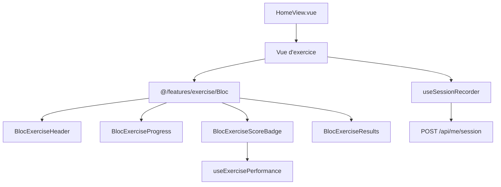
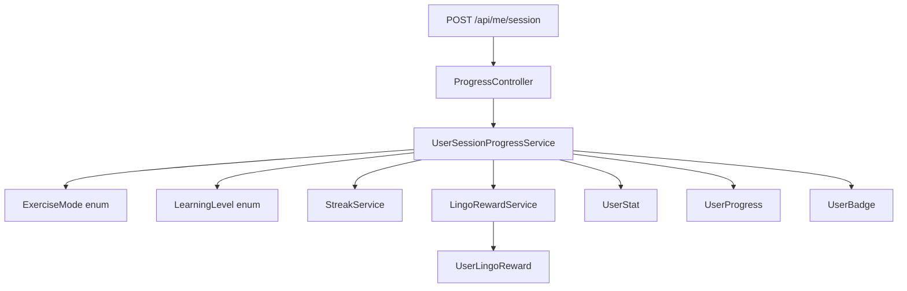
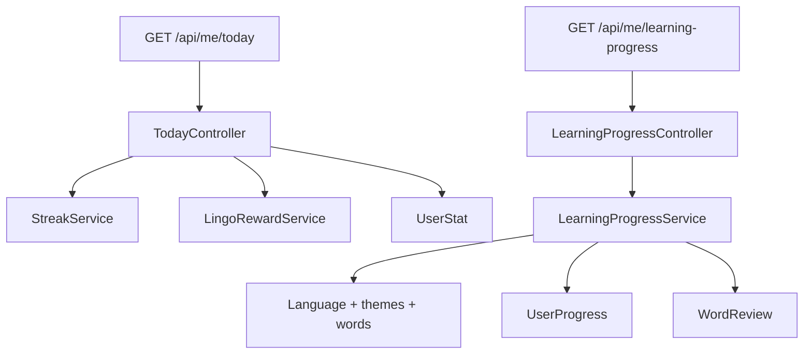

# Architecture de LinguaFacil

## Vue d'ensemble

```text
Website-Project/
├── frontend/                 Vue 3 + TypeScript + Vite
│   ├── src/api/              Client HTTP et API métier
│   ├── src/components/       Composants généraux
│   ├── src/composables/      Logique réutilisable
│   ├── src/data/             Données encore statiques uniquement
│   ├── src/features/exercise/ Domaine frontend des exercices
│   │   ├── Bloc/             Blocs UI partagés BlocExercise*
│   │   └── composables/      Logique exercice réutilisable
│   ├── src/stores/           Pinia
│   ├── src/types/            Types partagés
│   ├── src/utils/            Speech, comparaison de texte, drapeaux
│   ├── src/views/            Écrans et modes
│   └── src/router/index.ts    Routes frontend
├── backend/                  Laravel 13, PHP 8.3, Sanctum
│   ├── app/Enums/            Valeurs métier autorisées
│   ├── app/Http/Controllers/Api/
│   ├── app/Http/Resources/
│   ├── app/Models/
│   ├── app/Services/         Logique métier et orchestration
│   ├── database/data/        Catalogues JSON durables
│   ├── database/migrations/
│   ├── database/seeders/
│   ├── routes/api.php
│   └── tests/
├── scripts/                  Générateurs de catalogues/seeders
└── .github/workflows/ci.yml  CI frontend et backend
```

Les fichiers `index.html`, `style.css` et `script.js` à la racine appartiennent à l'ancienne application et sont hors périmètre.

## Frontend

- Vue 3.5, TypeScript, Composition API avec `<script setup>`.
- Pinia : `stores/lang.ts` et `stores/auth.ts`.
- Vue Router : routes paresseuses dans `router/index.ts`.
- Vite écoute sur `http://localhost:5173` et proxy `/api` et `/sanctum` vers `http://127.0.0.1:8000`.
- CSS global dans `src/assets/main.css`, avec variables de thème clair/sombre.

### Architecture R1-R5 à préserver

- Types partagés : `src/types/index.ts`.
- Comparaison normalisée/Levenshtein : `src/utils/textMatching.ts`.
- Synthèse vocale et mapping BCP47 : `src/utils/speech.ts`.
- Enregistrement de sessions/XP : `src/composables/useSessionRecorder.ts`.
- Domaine exercice refactorisé (phase Codex du 18 juin 2026) :
  - `src/features/exercise/Bloc/BlocExerciseHeader.vue`
  - `src/features/exercise/Bloc/BlocExerciseProgress.vue`
  - `src/features/exercise/Bloc/BlocExerciseResults.vue`
  - `src/features/exercise/Bloc/BlocExerciseScoreBadge.vue`
  - `src/features/exercise/Bloc/index.ts`
  - `src/features/exercise/composables/useExercisePerformance.ts`
- Les vues doivent assembler ces briques au lieu de recopier leur logique.
- Les nouveaux blocs UI partagés d'exercice vont dans `frontend/src/features/exercise/Bloc/`, avec un nom de fichier préfixé `BlocExercise`.
- Les vues importent les blocs via `@/features/exercise/Bloc`, pas via des chemins directs vers les fichiers `.vue`.
- La logique de score, statut ou performance d'exercice doit rester dans `features/exercise/composables/` ou dans un composable dédié, pas dans un composant visuel.
- Ne réintroduis pas `frontend/src/components/exercise/`.

### Schéma frontend exercice



Règles à conserver :

- une vue d'exercice orchestre l'expérience utilisateur;
- un bloc `BlocExercise...` affiche un morceau d'interface réutilisable;
- un composable porte la logique réutilisable;
- l'enregistrement de session passe par `useSessionRecorder` puis `/api/me/session`.

### Modes actuellement routés

`quiz`, `cards`, `fill-blank`, `learn`, `listen`, `speak`, `review`, `difficult`, `sentence-builder`, `dictee`, `paires`, `dialogue`, `anagram`, `survival`, `voyage`, `stories`, `conjugaison`, `traduction`, `devinette`, plus login, inscription, profil et classement.

### HomeView

- Les modes sont déclarés dans le tableau `modes`.
- Les modes sans thème sont dans `NO_THEME_MODES`.
- Valeur observée : `dialogue`, `survival`, `voyage`, `stories`, `conjugaison`.
- Ajouter une fonctionnalité nécessite une route, un mode HomeView, un cas de navigation et éventuellement une extension des modes XP.

## Backend

- Laravel 13.8, PHP 8.3, Sanctum 4.3.
- Base locale par défaut : SQLite dans `backend/database/database.sqlite`.
- Contrôleurs API fins, modèles Eloquent avec relations, Resources pour le catalogue standard.
- Routes privées sous `/api/me` avec `auth:sanctum`.
- Contenu public : langues, thèmes, mots, grammaire, dialogues, histoires et conjugaisons.

### Structure backend refactorisée

```text
backend/app/
├── Enums/
│   ├── ExerciseMode.php
│   └── LearningLevel.php
├── Http/Controllers/Api/
│   ├── LearningProgressController.php
│   ├── ProgressController.php
│   └── TodayController.php
├── Models/
├── Services/
│   ├── LearningProgressService.php
│   ├── LingoRewardService.php
│   ├── StreakService.php
│   └── UserSessionProgressService.php
└── Http/Resources/
```

### Schéma backend progression





Règles à conserver :

- un contrôleur API valide la requête et compose la réponse HTTP;
- un service contient la logique métier ou l'orchestration;
- un enum centralise les valeurs autorisées partagées par plusieurs points du back;
- un modèle Eloquent reste responsable des relations, casts et accès base;
- une Resource transforme les modèles de catalogue pour l'API publique;
- ne remets pas de calcul de progression, streak, Lingos ou statut pédagogique directement dans les contrôleurs.

### Données et responsabilité

- Vocabulaire, thèmes, langues et grammaire : `database/data/linguafacil.json` puis `LinguaFacilSeeder`.
- Dialogues historiques : `database/data/dialogues.json`.
- Dialogues phase 27 : générateur `scripts/generate_dialogue_expansions.mjs`, sortie `dialogue_expansions.json`, puis `DialogueSeeder`.
- Conjugaisons : `database/data/conjugations.json`, puis `ConjugationSeeder`.
- Histoires : source `frontend/src/data/stories.ts`, générateur `scripts/generate_seeders.mjs`, sortie `StorySeeder.php`.
- `DatabaseSeeder` appelle LinguaFacil, Dialogue, Story et Conjugation dans cet ordre.

### SRS et progression

- `ProgressController` valide `/api/me/session` puis délègue l'enregistrement à `UserSessionProgressService`.
- `TodayController` expose le résumé quotidien et délègue le calcul de série à `StreakService`.
- `LearningProgressController` délègue la progression pédagogique à `LearningProgressService`.
- `LingoRewardService` gère les Lingos et récompenses journalières.
- `ReviewController` gère les révisions espacées.
- Tables/modèles clés : `UserStat`, `UserProgress`, `UserBadge`, `UserLingoReward`, `WordReview`.

## R1-R5 consolidées

La refonte `refactor: structure application et qualité R1-R5` a notamment :

- centralisé types, utilitaires, composants d'exercice et session recorder côté Vue;
- déplacé dialogues et conjugaisons volumineux vers les catalogues backend;
- renforcé modèles, relations, contrôleurs et Resources Laravel;
- ajouté des tests frontend Vitest et backend PHPUnit;
- ajouté ESLint, Pint et une CI GitHub exécutant lint, tests et build.

Ne réintroduis pas les anciennes structures supprimées, notamment les gros fichiers `frontend/src/data/dialogues.ts` et `frontend/src/data/conjugations.ts`.

## Langues prises en charge

`es`, `en`, `de`, `it`, `pt`, `nl`, `pl`, `tr`, `ru`, `ja`, `ko`, `zh`, `ar`, `hi`.

Pour le texte arabe, prévoir le sens RTL. Pour la parole, utiliser les mappings BCP47 centralisés plutôt qu'une table locale dans chaque vue.
